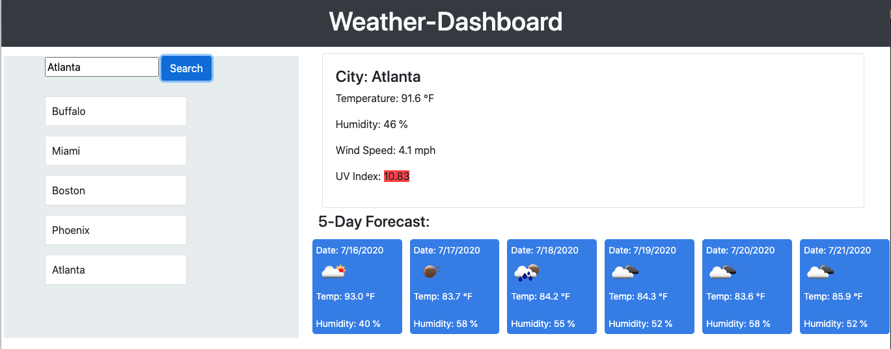

<h1>Weather Dashboard</h1>
<h2>John Manouse</h2>

I created a Weather Dashboard that will allow you to enter a city and retrieve the local weather. The cities you enter will appear in the text area and will be saved to local storage. The weather forecast is returned via a third party API, that includes today's weather, as well as a five day forecast.

 <a href= "https://openweathermap.org/api/.">Open Weather API</a> is the site used for the weather API.

 

<h2>Weather Dashboard</h2>
<ul>
    <li>HTML code</li>
    <li>CSS</li>
    <li>Javascript</li>
    <li>jQuery</li>
    <li>HTTP GET</li>
</ul>

<h2>Pull Requests welcome for contribution</h2>

John Manouse

Live Link: <a href="https://mirageg4.github.io/Weather-Dashboard/.">Weather Dashboard</a>

Github: <a href="https://github.com/Mirageg4/Weather-Dashboard/.">Weather Dashboard Repo</a>

              

License: Project is licensed under the MIT License. 
See <a href ="LICENSE.md">LICENSE</a> file for details.

